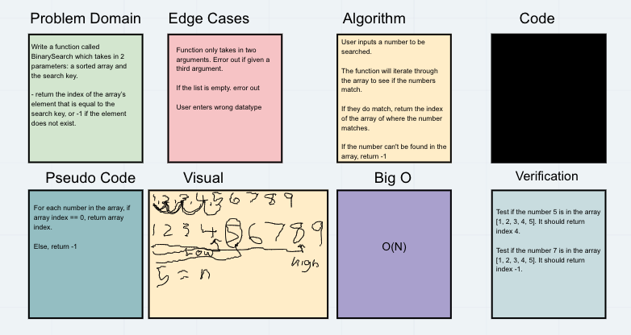

## Array Binary Search
We are to write a function that takes in two arguments, the array and the number searched.

## Challenge
Display the index of the number being searched or return -1 if not found. 

## Approach & Efficiency
Utilizing binary search will yeild less iterations as oppose to sequential search.

## Collaborators
Louis Caruso

## Solution

## Updates
- Brute forced iterating through the array