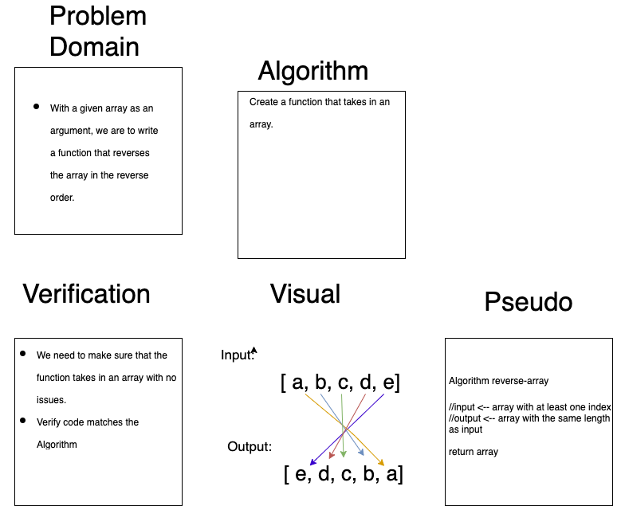

# Reverse an Array
With a given array as an argument, we are to write a function that reverses the array in the reverse order. 

## Challenge
Display the array in the reverse order. 

## Approach & Efficiency
We need to examine the array and think about some cases where it will not function correctly, or psuedo code. 

## Solution
