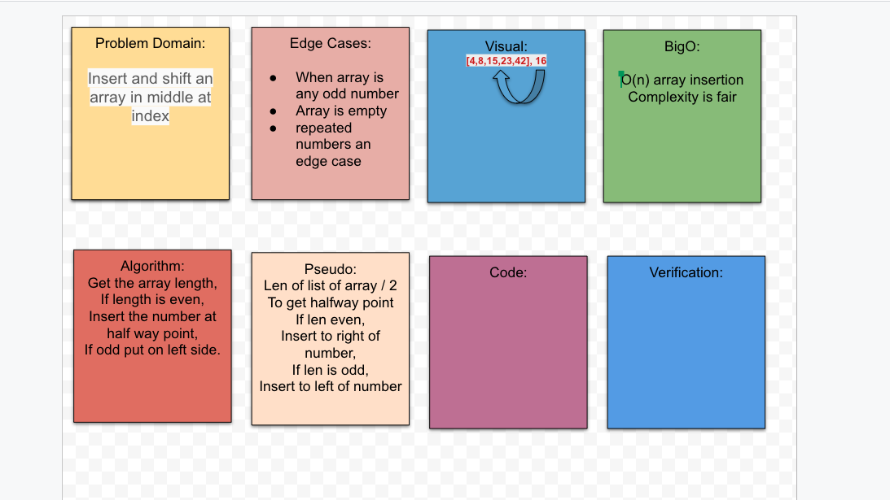

## Shift an Array
With a given array as an argument, we are to write a function that inserts a number in the middle of the array.

## Challenge
Display the array with the number inserted in the middle. 

## Approach & Efficiency
We need to examine the array and think about some cases where it will not function correctly, or psuedo code. 

## Collaborators
Brandon Gonzalez and Audrena Vacirca

## Solution

