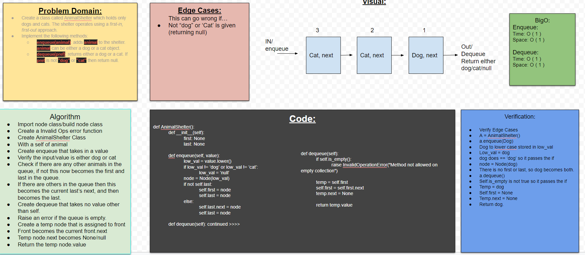

## FIFO Animal Shelter
Create a class called AnimalShelter which holds only dogs and cats. The shelter operates using a first-in, first-out approach.

## Challenge
Implement the following methods:
- `enqueue(animal)`: adds animal to the shelter. Animal can be either a dog or a cat object.
- `dequeue(pref)`: returns either a dog or a cat. If pref is not "dog" or "cat" then return null.

## Approach & Efficiency
We need to make sure that code challenge 10 has a working stacks and queues implementation, which is a prerequisite for completing this code challenge. 

## Collaborators
Anthony, Nebiyu, Jae, Brandon

## Solution

