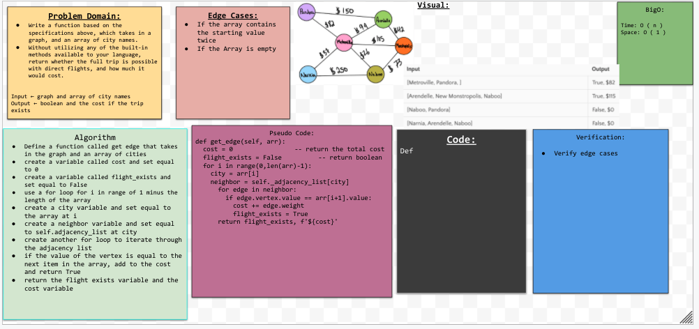

## Features
Write a function based on the specifications above, which takes in a graph, and an array of city names. Without utilizing any of the built-in methods available to your language, return whether the full trip is possible with direct flights, and how much it would cost.

## Testing
For testing, we need a working implementation of graphs before testing the following:

- Return True for flights that exist
- Add weights to total and return total
- Return False for flights that don't exist and return total at $0

## Collaborators
Sam Clark

## Solution 
