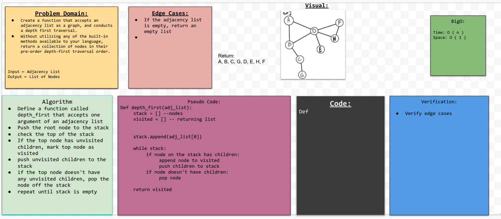

## Features

`AddNode()` method should:
- Adds a new node to the graph
- Takes in the value of that node
- Returns the added node

`AddEdge()` method should:
- Adds a new edge between two nodes in the graph
- Include the ability to have a “weight”
- Takes in the two nodes to be connected by the edge
- Both nodes should already be in the Graph

`GetNodes()` method should:
- Returns all of the nodes in the graph as a collection (set, list, or similar)

`GetNeighbors()` method should:
- Returns a collection of edges connected to the given node
- Takes in a given node
- Include the weight of the connection in the returned collection

`Size()` method should:
- Returns the total number of nodes in the graph

`breadth_first` traversal method should:
- Accepts a starting node
- Return a collection of nodes in the order they were visited
- Display the collection

`depth_first` traversal method should:
- Accepts an adjacency list
- Return a collection of nodes in the order they were visited
- Display the collection

## Testing
- Node can be successfully added to the graph
- An edge can be successfully added to the graph
- A collection of all nodes can be properly retrieved from the graph
- All appropriate neighbors can be retrieved from the graph
- Neighbors are returned with the weight between nodes included
- The proper size is returned, representing the number of nodes in the graph
- A graph with only one node and edge can be properly returned
- An empty graph properly returns null

## Collaborators
Sam Clark

## White Board
