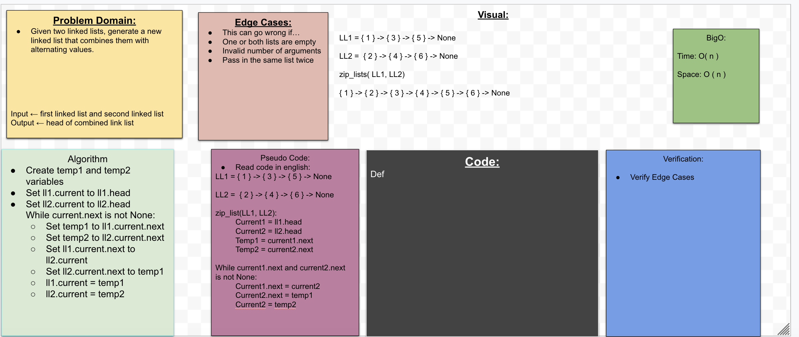

## Zip List 
Given a two linked lists as arguments, we are to generate a new linked list that combines them with alternating values.

## Challenge
1. Can successfully combine two linked lists and return the new linked list

## Approach & Efficiency
The previous code challenges has useful tools that we can use for the current code challenge. We used google to help us out with plenty of examples. 

## Collaborators
Brandon Gonzalez

## Solution

### Linked Lists

## Pull Request 
https://github.com/kmangub/data-structures-and-algorithms/pull/28