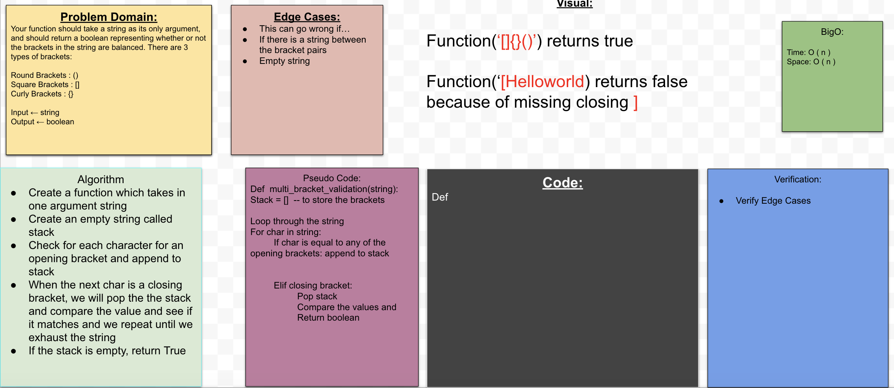

## Queue with Stacks
The function should take a string as its only argument, and should return a boolean representing whether or not the brackets in the string are balanced. There are 3 types of brackets:

Round Brackets : `()`
Square Brackets : `[]`
Curly Brackets : `{}`

## Challenge

When we run the function, we should get the following outputs:

| Input | Output  |
|---|---:|
| `{}`  |  True |   
| `{}(){}`  |  True | 
| `()[[Extra Characters]]`  |  True | 
|  `(){}[\[]]` |  True |
| `{}{Code}[Fellows](())`  | True  | 
| `[({}]` | False  | 
| `(](`  | False  | 
| `{(})`  | False | 

## Approach & Efficiency
Using stacks for this code challenge will make things easier since we are dealing with paired brackets.  

## Solution

## Pull Request 
https://github.com/kmangub/data-structures-and-algorithms/pull/25