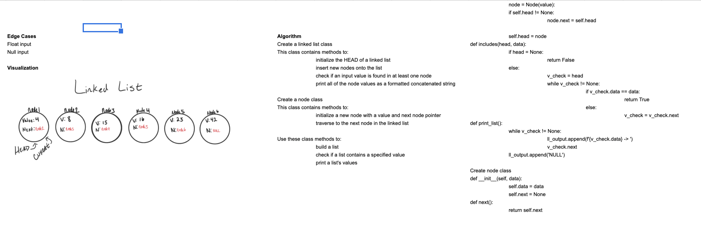

## Queue with Stacks
Make a new class called PseudoQueue that has two methods and includes standard Queue methods, but only uses 2 internal stack objects.

## Challenge
- `enqueue(value)` which inserts value into the PseudoQueue, using a first-in, first-out approach.
- `dequeue()` which extracts a value from the PseudoQueue, using a first-in, first-out approach.

## Approach & Efficiency
We need to make sure that code challenge 10 has a working stacks and queues implementation, which is a prerequisite for completing this code challenge. 

## Collaborators
Anthony, Nebiyu, Jae, Brandon

## Solution

## Pull Request 
https://github.com/kmangub/data-structures-and-algorithms/pull/25