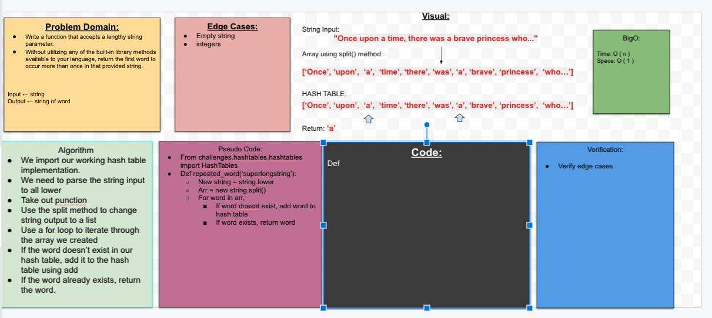

## Repeated Word
- Write a function that accepts a lengthy string parameter.
- Without utilizing any of the built-in library methods available to your language, return the first word to occur more than once in that provided string.

## Challenge
- Write at least three test assertions for each method that you define.

- Ensure your tests are passing before you submit your solution.

## Approach & Efficiency
We need to make sure that we have a working hash table implementation, which is a prerequisite for completing this code challenge. 

## Collaborators
Brandon, Sam, Mason

## Solution

