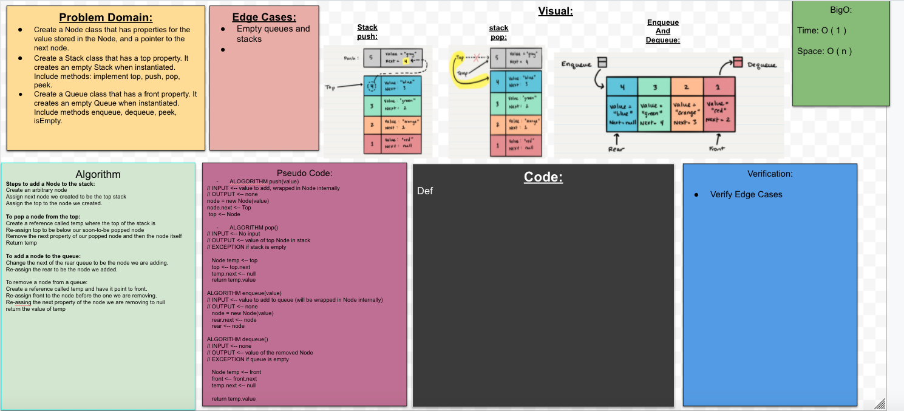

## Stacks and Queues
1. Create a Node class that has properties for the value stored in the Node, and a pointer to the next node.
2. Create a Stack class that has a top property. It creates an empty Stack when instantiated. Include methods: implement top, push, pop, peek.
3. Create a Queue class that has a front property. It creates an empty Queue when instantiated. Include methods enqueue, dequeue, peek, isEmpty.

## Challenge
1. Can successfully push onto a stack
1. Can successfully push multiple values onto a stack
1. Can successfully pop off the stack
1. Can successfully empty a stack after multiple pops
1. Can successfully peek the next item on the stack
1. Can successfully instantiate an empty stack
1. Calling pop or peek on empty stack raises exception
1. Can successfully enqueue into a queue
1. Can successfully enqueue multiple values into a queue
1. Can successfully dequeue out of a queue the expected value
1. Can successfully peek into a queue, seeing the expected value
1. Can successfully empty a queue after multiple dequeues
1. Can successfully instantiate an empty queue
1. Calling dequeue or peek on empty queue raises exception

## Approach & Efficiency
The Stacks and Queues reading prior to class was a good resource to use. The reading contains Psuedo code that we can use to create the methods for the class. We also used google to help us out with plenty of examples. 

## Solution

