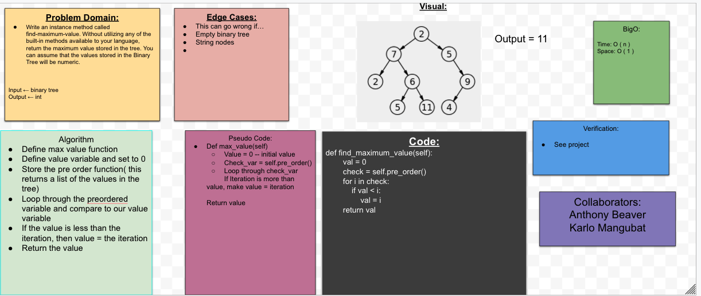
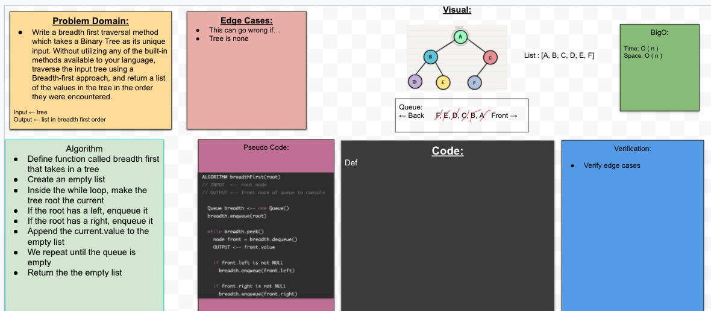

## Tree
Write an instance method called `find-maximum-value`. Without utilizing any of the built-in methods available to your language, return the maximum value stored in the tree. You can assume that the values stored in the Binary Tree will be numeric.

## Challenge
- Function returns the largest value in the Binary Tree

## Approach & Efficiency
We need to make sure that code challenge 15 has a Binary Tree implementation, which is a prerequisite for completing this code challenge. 

## Collaborators
Anthony, Alex

## Solution

## Pull Request 
https://github.com/kmangub/data-structures-and-algorithms/pull/43

## Breadth First
Write a breadth first traversal method which takes a Binary Tree as its unique input. Without utilizing any of the built-in methods available to your language, traverse the input tree using a Breadth-first approach, and return a list of the values in the tree in the order they were encountered.

## Challenge
- Function returns the list in breadth first order

## Approach & Efficiency
We need to make sure that code challenge 15 has a Binary Tree implementation, which is a prerequisite for completing this code challenge. 

## Collaborators
Anthony

## Solution

## Pull Request 
