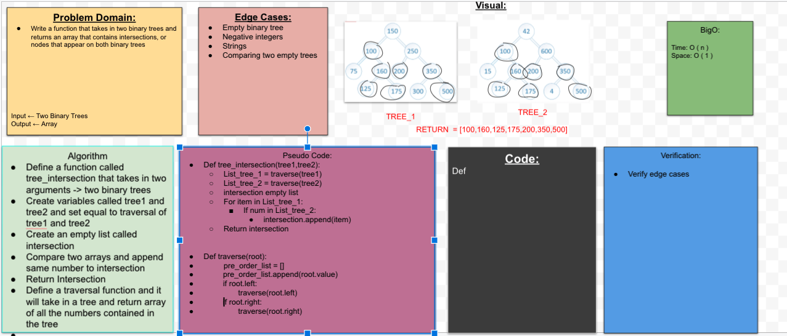

## Tree Intersection 
Write a function that takes in two binary trees and returns an array that contains intersections, or nodes that appear on both trees

## Challenge
- Write three tests that satisfy the requirement.

## Approach & Efficiency
We need to make sure that our Binary Tree implementation is working. Then choose a way to traverse through the tree and grab the list it returns.

## Collaborators
Brandon and Sam

## Solution

